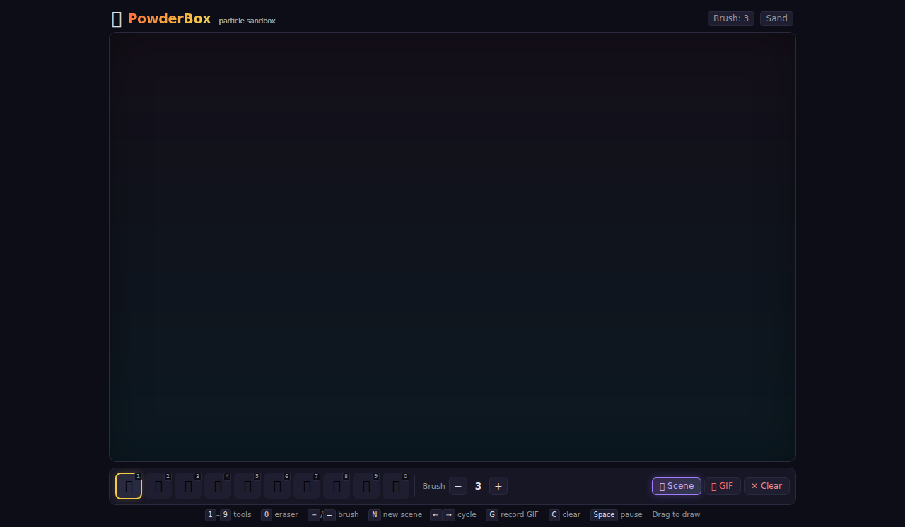
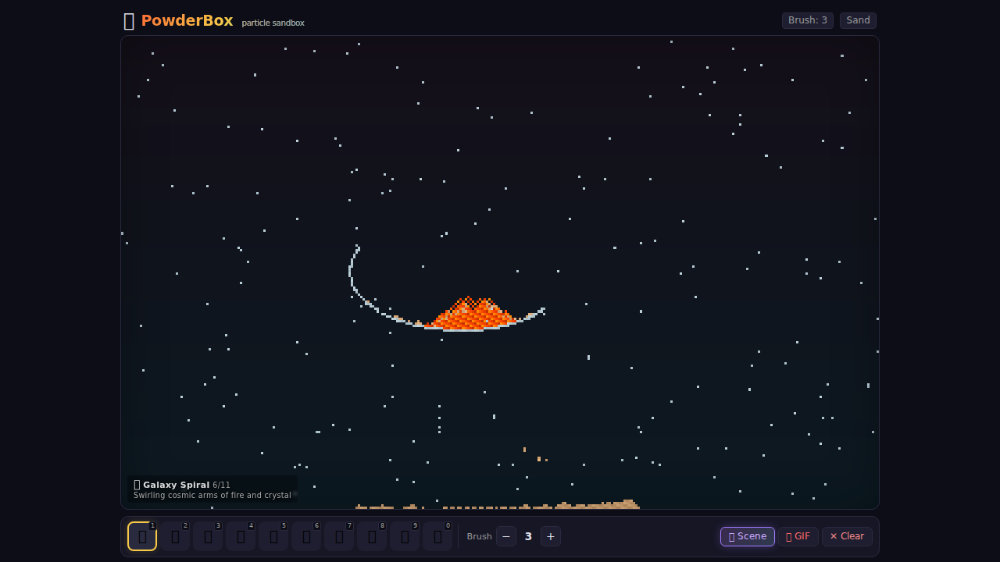
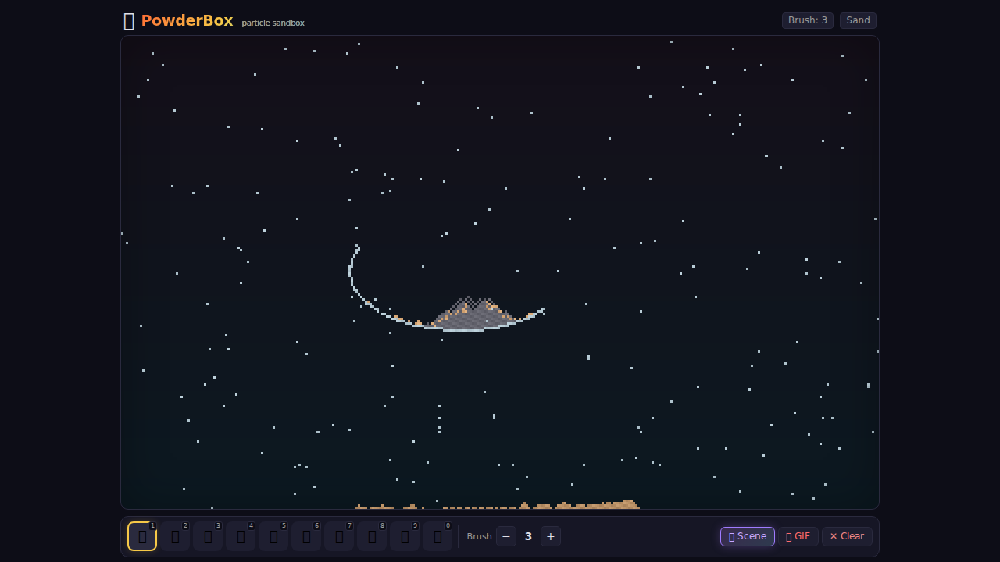
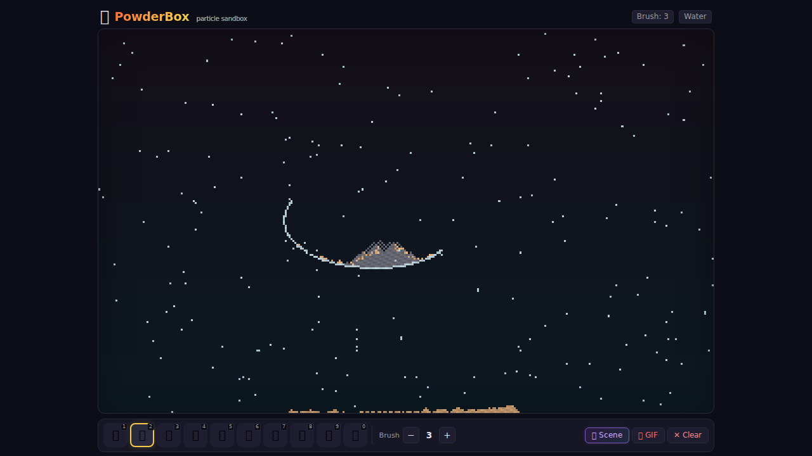
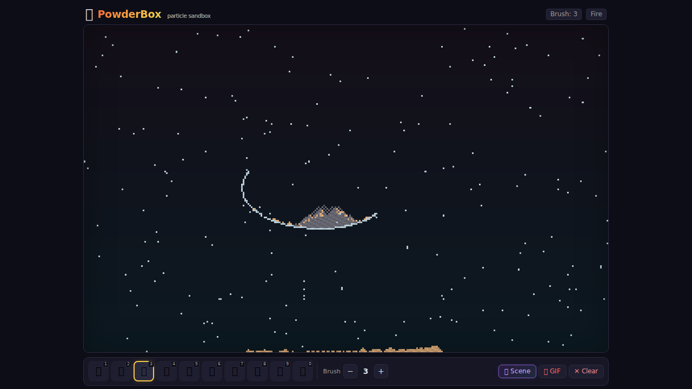

# 🧪 PowderBox

**A gorgeous, high-performance particle sandbox simulation in your browser.**

Draw with sand, water, fire, lava, acid, and more. Watch emergent physics unfold in real-time at 60fps. Zero dependencies beyond the browser.

[**🌐 Live Demo**](https://aieatassam.github.io/powder-box/) — play with PowderBox right now, no install needed

---

## ✨ What It Looks Like

| Clean UI | Generated Scenes | Particle Physics |
|:---:|:---:|:---:|
|  |  |  |
| **Water + Sand** | **Fire Interactions** | **10 Elements** |
|  |  | 10 elements, endless combinations |

> Screenshots from the live app at **https://aieatassam.github.io/powder-box/**

---

## 🎯 Features

### 🧩 10 Elements

| # | Element | Behaviour |
|:-:|:--------|:----------|
| 1 | 🟤 **Sand** | Falls, piles up, forms slopes |
| 2 | 🔵 **Water** | Flows, spreads, pools |
| 3 | 🔥 **Fire** | Rises, spreads to flammable materials |
| 4 | 🧱 **Wall** | Indestructible barrier |
| 5 | 🪵 **Wood** | Flammable — burns when fire touches it |
| 6 | 🛢️ **Oil** | Flammable, floats on water — explodes near fire |
| 7 | 🌿 **Plant** | Grows, burns |
| 8 | 🌋 **Lava** | Melts through, solidifies into rock |
| 9 | 🧪 **Acid** | Dissolves most materials |
| 0 | 🧹 **Eraser** | Remove anything |

### 🔥 Emergent Interactions

- **Water + Fire** → Steam (cloud particles)
- **Oil + Fire** → 💥 Explosion (chain reaction!)
- **Lava + Water** → Steam + solid rock
- **Lava + Wood** → Fire + destruction
- **Acid + most things** → Dissolves on contact
- **Fire + Wood/Plants** → Spreads and burns

### 🎮 Controls

| Key | Action |
|:---|:-------|
| `1` – `9` | Select element tool |
| `0` | Eraser |
| `-` / `=` | Decrease / Increase brush size |
| `G` | Record & export 3s GIF |
| `C` | Clear the canvas |
| `Space` | Pause / Resume simulation |
| `🎲 Scene` | Procedurally generate interesting compositions |

### 🎬 GIF Export
Record your creations as animated GIFs (3 seconds) with one click — shareable, embeddable, no tools needed.

### 📱 Touch-Friendly
Works great on mobile — touch to draw, pinch-friendly layout, scrollable toolbar.

---

## 🏗️ Architecture

PowderBox achieves **smooth 60fps physics** through a clean Web Worker architecture:

```
┌─────────┐   mouse/touch   ┌──────────┐   pixel buffer   ┌────────────┐
│ Browser ├────────────────▶│ main.ts  ├─────────────────▶│ Worker     │
│ (render) │                 │ (input)   │  (transferable)  │ (physics)  │
└─────────┘                  └──────────┘                   └────────────┘
```

- **Grid**: 320 × 200 cells as a flat `Uint8Array` (one byte per cell = 64KB total)
- **Worker**: Owns the entire grid state, processes physics bottom-up with alternating scan directions to prevent directional bias
- **Rendering**: `requestAnimationFrame` loop sends tick commands; worker returns an RGBA pixel buffer transferred via `postMessage` zero-copy
- **GIF Export**: Custom `GIFEncoder` with a known palette (skips NeuQuant quantization for speed)

### Why a Web Worker?
The physics loop iterates every cell every frame. At 60fps that's **3.8 million cell-checks/second**. Running this on the main thread would block rendering completely — the Worker keeps the UI buttery smooth.

---

## 🚀 Quick Start

```bash
git clone https://github.com/AieatAssam/powder-box.git
cd powder-box
npm install
npm run dev
```

Open `http://localhost:5173` and start drawing.

### Build for Production

```bash
npm run build      # outputs to dist/
npm run preview    # preview the production build locally
```

### Deploy to GitHub Pages

1. Push to the `main` branch
2. The included [GitHub Actions workflow](.github/workflows/deploy.yml) handles the rest
3. Your site will be live at `https://<username>.github.io/powder-box/`

**Already live:** [**🌐 https://aieatassam.github.io/powder-box/**](https://aieatassam.github.io/powder-box/)

---

## ⚙️ Tech Stack

| Layer | Technology |
|:------|:-----------|
| Runtime | Browser (Web Worker + Canvas) |
| Language | TypeScript |
| Build | Vite |
| Physics | Custom grid simulation in Web Worker |
| GIF | `gif.js` with custom palette encoder |
| Rendering | `OffscreenCanvas`-style pixel buffer transfer |

**Zero runtime dependencies.** The only npm packages are build/dev tools.

---

## 💡 Inspiration

PowderBox is a modern take on the classic "falling sand" / "powder toy" genre — reimagined with:

- ✅ Modern TypeScript tooling
- ✅ Web Worker performance
- ✅ Procedural scene generation
- ✅ GIF export built in
- ✅ No Flash, no plugins, no hassle

---

## 📜 License

MIT — see [LICENSE](LICENSE) for details.

---

<p align="center">
  <strong><a href="https://aieatassam.github.io/powder-box/">🌐 Try PowderBox Now →</a></strong>
</p>
