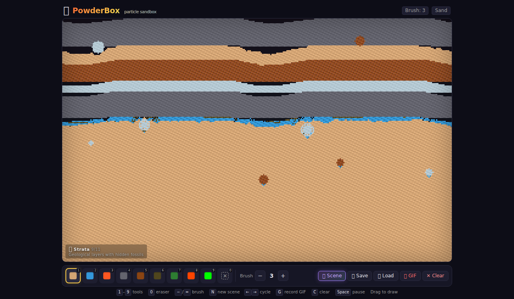
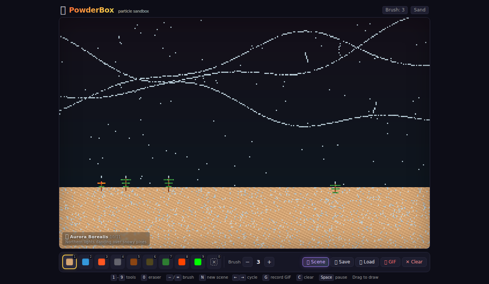
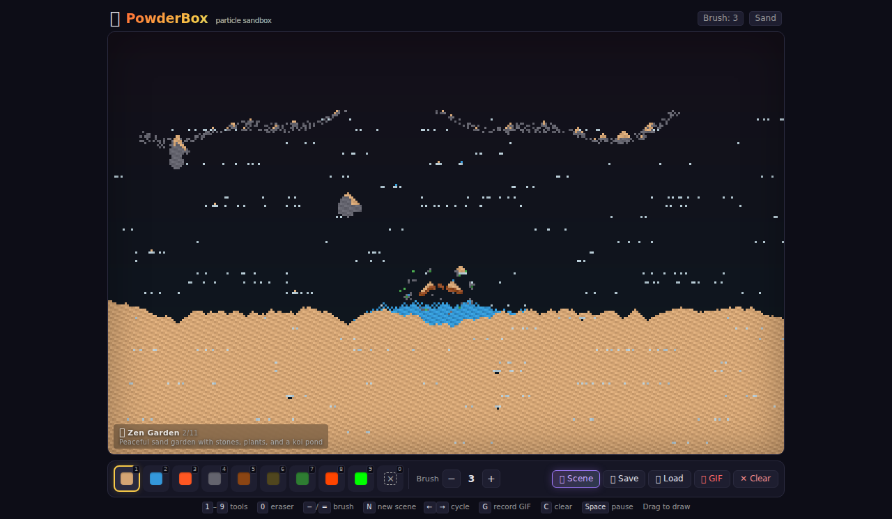
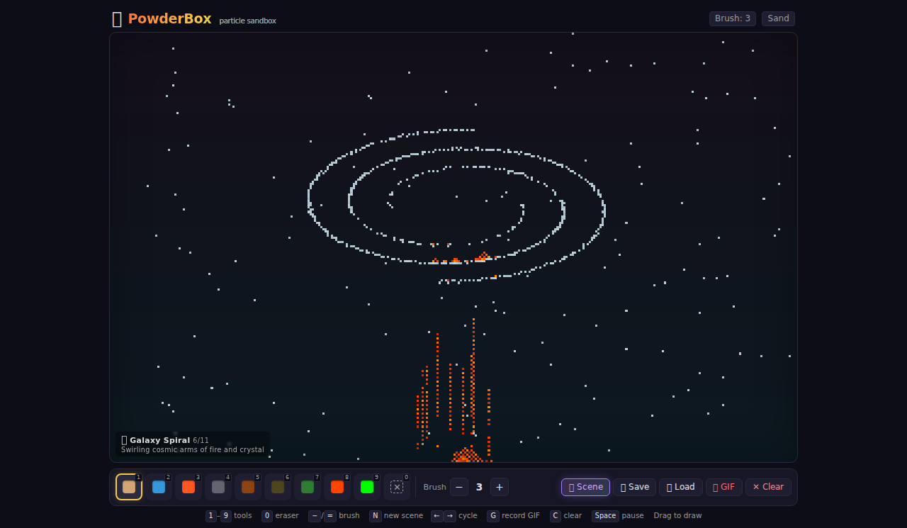
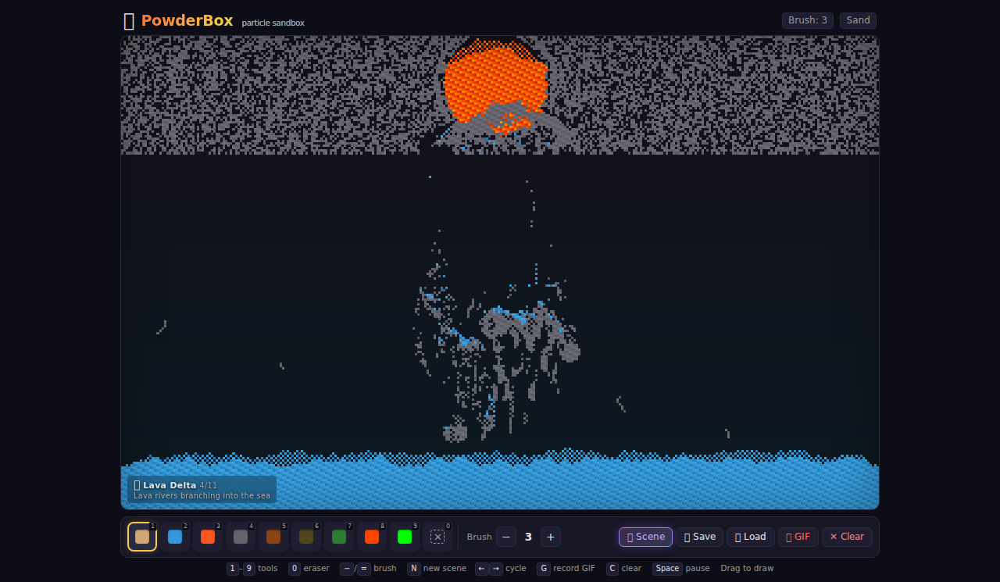
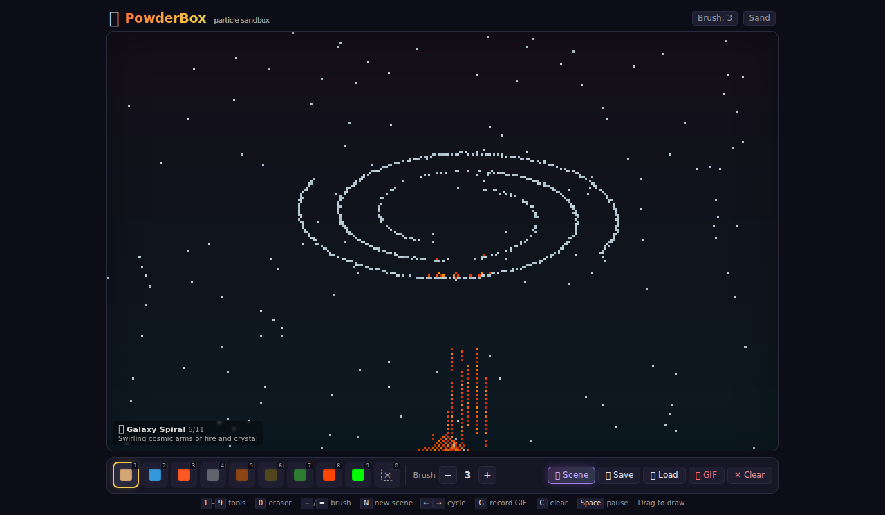

# 🧪 PowderBox

**A gorgeous, high-performance particle sandbox simulation in your browser.**

Draw with sand, water, fire, lava, acid, and more. Watch emergent physics unfold in real-time at 60fps. Zero runtime dependencies — just a browser.

[**🌐 Live Demo**](https://aieatassam.github.io/powder-box/) — play with PowderBox right now, no install needed

---

## ✨ What It Looks Like

### Procedurally Generated Scenes

| | | |
|:-:|:-:|:-:|
|  |  |  |
|  |  |  |

Each click of **🎲 Scene** generates a unique composition — islands, canyons, mandalas, galaxies, caves, and more — that physics brings to life.

> Screenshots from the live app at **https://aieatassam.github.io/powder-box/**

---

## 🎯 Features

### 🎮 10 Element Tools

The toolbar shows colour swatches that exactly match each element's in-game palette colour:

| # | Element | Behaviour |
|:-:|:--------|:----------|
| 1 | **Sand** | Falls, piles up, forms slopes and dunes |
| 2 | **Water** | Flows, spreads, pools, extinguishes fire |
| 3 | **Fire** | Rises, spreads to flammable materials, emits smoke |
| 4 | **Wall** | Indestructible barrier — great for structures |
| 5 | **Wood** | Flammable — burns slowly when fire touches it |
| 6 | **Oil** | Flammable, floats on water — explodes near fire |
| 7 | **Plant** | Grows, catches fire easily |
| 8 | **Lava** | Melts through, solidifies into rock over time |
| 9 | **Acid** | Dissolves most materials on contact |
| 0 | **Eraser** | Remove anything |

### 🔥 Emergent Interactions

- **Water + Fire** → Steam (cloud particles that rise and condense)
- **Oil + Fire** → 💥 Explosion with chain reaction
- **Lava + Water** → Steam explosion + solid rock
- **Lava + Wood/Plants** → Fire + destruction
- **Acid + most things** → Dissolves on contact
- **Wood burning** → Slowly chars then ignites into fire

### 🎲 11 Procedural Scenes

Generate stunning, unique starting scenes with one click — each is different every time, and the physics brings them to life:

1. **🌋 Volcano Island** — Erupting cone with lava cascades, surrounded by ocean
2. **🪨 Zen Garden** — Raked sand, koi pond with bridge, clustered stones
3. **💧 Waterfall Canyon** — Multi-tier waterfall plunging into a misty pool
4. **🌊 Lava Delta** — Braided lava rivers flowing from a caldera into the sea
5. **🌀 Mandala** — Compartmented geometric rings with trapped elements
6. **🌌 Galaxy Spiral** — Dual spiral arms of fire, glass, and lava
7. **🏖️ Sunset Beach** — Tropical shore with palms, tide pools, and seashells
8. **🕯️ Bioluminescent Cave** — Glowing crystals, acid pools, and mushrooms
9. **📐 Strata** — Geological layers with faults, fossils, and geodes
10. **🌠 Aurora Borealis** — Aurora bands over snowy pines
11. **🎨 Abstract Color Field** — Noise-driven bands with trapped fluid blobs

### 🎬 GIF Export
Record your creations as animated GIFs (3 seconds) with one click — shareable, embeddable, no extra tools needed.

### 💾 Save & Load
- **Save** (`Ctrl+S`): Download your canvas as a compact `.pbox` binary file (~125 KB)
- **Load** (`Ctrl+O`): Open a `.pbox` file to restore any saved world
- **Auto-save**: Your canvas is automatically saved to `localStorage` every 10 seconds — refresh the page without losing your work

### ⌨️ Controls

| Key | Action |
|:---|:-------|
| `1` – `9` | Select element tool |
| `0` | Eraser |
| `-` / `=` | Decrease / Increase brush size |
| `G` | Record & export 3s GIF |
| `N` | New procedural scene |
| `←` / `→` | Cycle scenes |
| `C` | Clear the canvas |
| `Space` | Pause / Resume simulation |
| `Ctrl+S` | Save canvas |
| `Ctrl+O` | Load canvas |

### 📱 Touch-Friendly
Works great on mobile — touch to draw, responsive layout, scrollable toolbar.

---

## 🏗️ Architecture

PowderBox achieves **smooth 60fps physics** through a clean Web Worker architecture:

```
┌─────────┐   mouse/touch   ┌──────────┐   pixel buffer   ┌────────────┐
│ Browser ├────────────────▶│ main.ts  ├─────────────────▶│ Worker     │
│ (render) │                 │ (input)   │  (transferable)  │ (physics)  │
└─────────┘                  └──────────┘                   └────────────┘
```

- **Grid**: 320 × 200 cells as a flat `Uint8Array` (one byte per cell = 64 KB total)
- **Worker**: Owns the entire grid state, processes physics bottom-up with alternating scan directions to prevent directional bias
- **Rendering**: `requestAnimationFrame` loop sends tick commands; worker returns an RGBA pixel buffer transferred via `postMessage` zero-copy
- **GIF Export**: Custom encoder with a known palette (skips NeuQuant quantization for speed)
- **Save/Load**: Binary `.pbox` format serialises grid + life arrays

### Why a Web Worker?
The physics loop iterates every cell every frame. At 60fps that's **3.8 million cell-checks/second**. Running this on the main thread would block rendering completely — the Worker keeps the UI buttery smooth.

---

## 🚀 Quick Start

```bash
git clone https://github.com/AieatAssam/powder-box.git
cd powder-box
npm install
npm run dev
```

Open `http://localhost:5173` and start drawing.

### Build for Production

```bash
npm run build      # outputs to dist/
npm run preview    # preview the production build locally
```

### Deploy to GitHub Pages

1. Push to the `main` branch
2. The included [GitHub Actions workflow](.github/workflows/deploy.yml) handles the rest
3. Your site will be live at `https://<username>.github.io/powder-box/`

**Already live:** [**🌐 https://aieatassam.github.io/powder-box/**](https://aieatassam.github.io/powder-box/)

---

## ⚙️ Tech Stack

| Layer | Technology |
|:------|:-----------|
| Runtime | Browser (Web Worker + Canvas 2D) |
| Language | TypeScript |
| Build | Vite |
| Physics | Custom grid simulation in Web Worker |
| GIF | `gif.js` with custom palette encoder |
| Rendering | `OffscreenCanvas`-style pixel buffer transfer |
| Save/Load | Binary `.pbox` format (magic bytes + grid data) |

**Zero runtime dependencies.** The only npm packages are build/dev tools and `gif.js`.

---

## 💡 Inspiration

PowderBox is a modern take on the classic "falling sand" / "powder toy" genre — reimagined with:

- ✅ Modern TypeScript tooling
- ✅ Web Worker performance (60fps physics)
- ✅ 11 procedural scene generators
- ✅ Save/load for sharing worlds
- ✅ GIF export built in
- ✅ Colour-accurate toolbar swatches
- ✅ Zero Flash, zero plugins, zero hassle

---

## 📜 License

MIT — see [LICENSE](LICENSE) for details.

---

<p align="center">
  <strong><a href="https://aieatassam.github.io/powder-box/">🌐 Try PowderBox Now →</a></strong>
</p>
